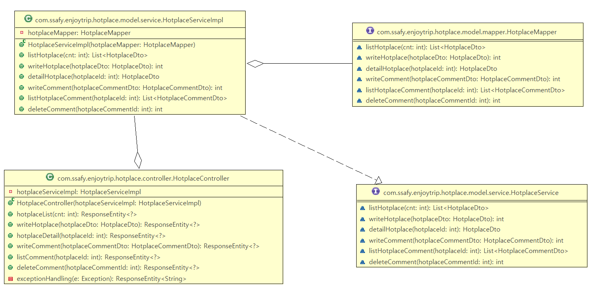
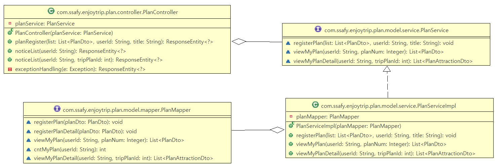
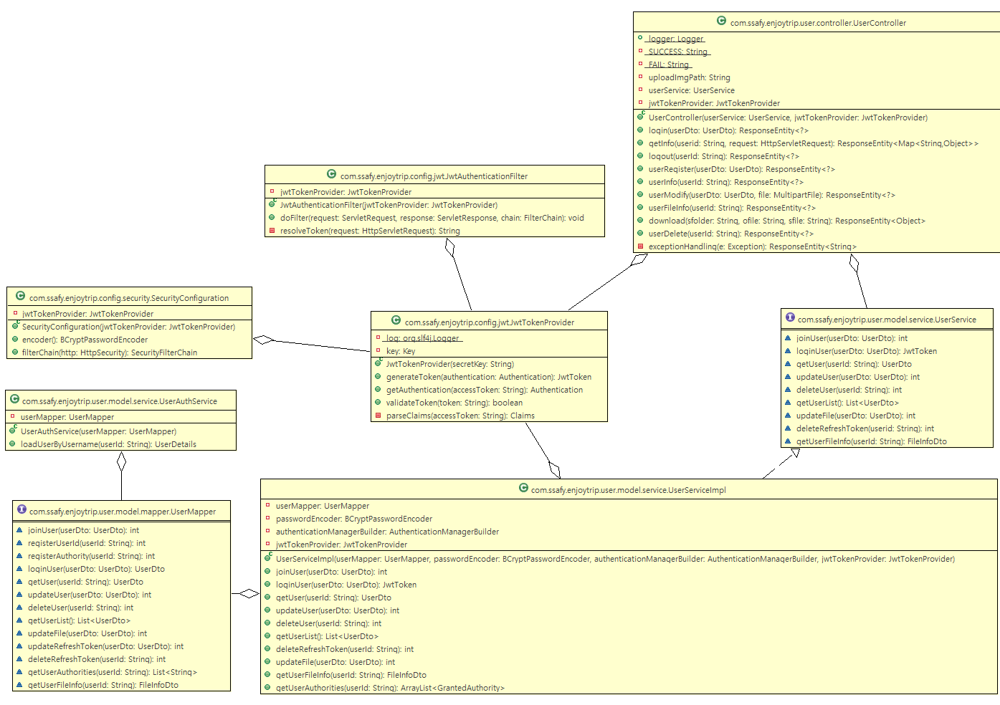

## 여행 계획 작성 및 여행지 공유 서비스

### 프로젝트 개발 기간

`2023.05.18.` - `2023.05.26.` (2주)

 

### 목차

- [개요](#-개요)
- [기능](#-기능)
- [사용 기술](#-사용-기술)
- [서비스 화면](#-서비스-화면)
  * [회원 관리](#회원-관리)
  * [마이페이지](#마이페이지)
  * [여행지](#여행지)
  * [나의 여행 계획](#나의-여행-계획)
  * [핫플레이스](#핫플레이스)
  * [공지사항](#공지사항)
- [산출물](#-산출물)
  * [화면 흐름도](#화면-흐름도)
  * [ERD](#erd)
  * [Class Diagram](#class-diagram)
  * [시스템 아키텍처](#시스템-아키텍처)
- [팀원 소개](#-팀원-소개)

  

## 📌 개요

- [공공데이터 포털](http://data.go.kr)의 오픈 API 활용
- 한국관광공사의 [한국관광공사\_국문 관광정보 서비스\_GW](https://www.data.go.kr/data/15101578/openapi.do)를 DB로 관리
- 해당 DB에서 관광지 데이터를 추출하여 필요한 데이터 표시
- 관광지 검색 및 여행 계획, 핫 플레이스 공유 기능을 가진 여행 테마의 웹 서비스 구현

 

## 📌 기능

- 관광지 정보 조회 및 여행 계획 기능
- Spring Security를 활용한 회원 관리
- 공지사항 게시판
- 파일 업/다운로드를 활용한 마이페이지
- 카카오 지도 API를 활용한 기능

 

## 📌 사용 기술

### Front-End

  
  
  
  
  

### Back-End

  
  
  

### Database

  

### VCS

  
  

### DevTool

  
  
  
  
  

 

## 📌 서비스 화면

### 회원 관리

| 로그인                                   | 회원가입                                     |
| ---------------------------------------- | -------------------------------------------- |
|  |  |

### 마이페이지

| 조회                                       | 수정                                            |
| ------------------------------------------ | ----------------------------------------------- |
|  |  |

### 여행지

| 여행지 선택 | 여행지 상세화면 |
| --- | --- |
|  |  |

### 나의 여행 계획

| 목록 |
| --- |
|  |

상세보기
| 지도 | 일정 |
| --- | --- |
|  |  |

### 핫플레이스

| 등록 | 목록 |
| --- | --- |
|  |  |

### 공지사항

| 작성 |
| --- |
| |

 

## 📌 산출물

### 화면 흐름도

### ERD

### Class Diagram

| Attraction (관광지)                                           | Noitce (공지사항)                                         |
| ------------------------------------------------------------- | --------------------------------------------------------- |
|  |  |

| Hotplace (핫 플레이스)                                   | Plan (여행 계획)                                       |
| -------------------------------------------------------- | ------------------------------------------------------ |
|  |  |

| User (사용자)                                          | Etc (기타 설정 파일)                                   |
| ------------------------------------------------------ | ------------------------------------------------------ |
|  |  |

### 시스템 아키텍처

 

## 📌 팀원 소개

| 연주원                                                                                                                                                                                                                     | 진병욱                                                                                                                                                                                             |
| -------------------------------------------------------------------------------------------------------------------------------------------------------------------------------------------------------------------------- | -------------------------------------------------------------------------------------------------------------------------------------------------------------------------------------------------- |
|  |  |
| 팀장  회원 관리  핫플레이스  최종 발표                                                                                                                                                                            | 팀원  관광지  여행 계획  공지사항                                                                                                                                                         |
